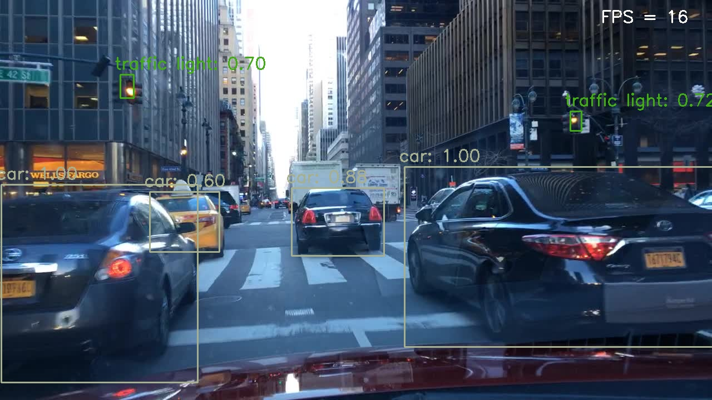

# MobileNet-SSD and MobileNetV2-SSD/SSDLite with PyTorch

Object Detection with MobileNet-SSD, MobileNetV2-SSD/SSDLite on VOC, BDD100K Datasets.

## Results
1. Detection



2. View the result on [Youtube](https://www.youtube.com/watch?v=0u3f4t-Wkv4)

## Dependencies
- Python 3.6+
- OpenCV
- PyTorch
- Pyenv (optional)
- tensorboard
- tqdm

## Dataset Path (optional)
The dataset path should be structured as follow:
```bashrc
$ pip install --user kaggle
$ kaggle datasets download solesensei/solesensei_bdd100k

# Unzip downloaded zip file
# follow instructions to conduct the directory structure as below.
|- bdd100k -- bdd100k -- images -- 100k -- train -- (70000 images)
|               |                        |- val -- (10000 images)
|                     |
|                     |- labels -- (.json)
|                     |
|                     |- xml -- train -- (.xml)
|                     |- val -- (.xml)
|
|- pytorch-ssd - data -- VOCdevkit -- test -- VOC2007 -- (Annotations, ImageSets, JPEGImages,...)
     (our repo)   |                    |- VOC2007 -- (Annotations, ImageSets, JPEGImages,...)
                  |
                  |- bdd_files
                  |- images
                  |- models
                  |- ...
                  |- train_ssd_BDD.py
                  |- ssd_test_img.py
                  |- ...
@TranLeAnh

$ mkdir bdd100k
$ mv solesensei_bdd100k.zip bdd100k
$ cd bdd100k
$ unzip solesensei_bdd100k.zip

# under 100k/train, some images are splitted into testA, testB, trainA, trainB.
# extract them out.
mv bdd100k/bdd100k/image bdd100k/

mv bdd100k/images/100k/train/testA/* bdd100k/images/100k/train/
mv bdd100k/images/100k/train/testB/* bdd100k/images/100k/train/
mv bdd100k/images/100k/train/trainA/* bdd100k/images/100k/train/
mv bdd100k/images/100k/train/trainB/* bdd100k/images/100k/train/

# bdd100k/bdd100k/labels is bdd100k/bdd100-_labels_release/bdd100k/labels
# Change location of it to satisfy above directory structure.
cp -r bdd100k_labels_release/bdd100k/labels/ ./bdd100k/
```
## Pre-processing
1. Convert BDD100K anotation format (.json) to VOC anotation format (.xml)
```bashrc
$ python bdd2voc.py
```
2. Remove training samples having no anotation (70000 to 69863)
```bashrc
python remove_nolabel_data.py
```
## Download Pre-trained Models (VOC)
1. MobileNet-SSD
```bashrc
$ wget -P models https://storage.googleapis.com/models-hao/mobilenet-v1-ssd-mp-0_675.pth
```
2. MobileNetV2-SSDLite
```bashrc
$ wget -P models https://storage.googleapis.com/models-hao/mb2-ssd-lite-mp-0_686.pth
```
## Train
1. Train MobileNet-SSD (VOC)
```bashrc
$ python train_ssd_VOC.py --datasets ~/data/VOCdevkit/VOC2007/ --validation_dataset ~/data/VOCdevkit/test/VOC2007/ --net mb1-ssd --batch_size 24 --num_epochs 100 --scheduler cosine --lr 0.01 --t_max 200
```
2. Train MobileNet-SSD (BDD100K)
```bashrc
$ python train_ssd_BDD.py --datasets ../bdd100k/bdd100k/images/100k/train/ --validation_dataset ../bdd100k/bdd100k/images/100k/val/ --net mb1-ssd --batch_size 48 --num_epochs 200 --scheduler cosine --lr 0.01 --t_max 200
```
3. Resume training a trained model (BDD100K)
```bashrc
$ python train_ssd_BDD.py --datasets ../bdd100k/bdd100k/images/100k/train/ --validation_dataset ../bdd100k/bdd100k/images/100k/val/ --net mb1-ssd --batch_size 48 --num_epochs 200 --scheduler cosine --lr 0.01 --t_max 200 --resume models/mb1-ssd-Epoch-105-Loss-inf.pth 
```
4. Train pretrained-model MobileNetV2-SSDLite (BDD100K)
```bashrc
$ python train_ssd_BDD.py --datasets ../bdd100k/bdd100k/images/100k/train/ --validation_dataset ../bdd100k/bdd100k/images/100k/val/ --net mb2-ssd-lite --pretrained_ssd models/mb2-ssd-lite-net.pth --scheduler cosine --lr 0.01 --t_max 100 --batch_size 36 --num_epochs 200 
```

## Resume Training
```bashrc
$ python train_ssd_BDD.py --datasets ../bdd100k/bdd100k/images/100k/train/ --validation_dataset ../bdd100k/bdd100k/images/100k/val/ --net mb2-ssd-lite --resume models/(trained-model-name).pth --batch_size 16 --num_epochs 100 --scheduler cosine --lr 0.001 --t_max 100 --debug_steps 10
```

## Test
1. Test on image
```bashrc
$ python ssd_test_img.py
```
2. Test on video
```bashrc
$ python ssd_test_video.py
```
## Produce Detection Information
- Print out text file (.txt) of dectection information
```bashrc
notebook: print_text_files.ipynb
```
- File format: {image_name}.txt [ class_name confidence x1 y1 x2 y2 ]
```bashrc
car 0.980528 194 356 466 513
car 0.897605 752 372 975 467
car 0.414176 580 372 646 416
traffic_light 0.605162 844 178 867 225
traffic_light 0.602555 816 176 841 224
traffic_light 0.495851 109 62 141 124
truck 0.580303 167 265 485 483
```

## References
- https://github.com/qfgaohao/pytorch-ssd
- https://github.com/leeesangwon/bdd100k_to_VOC

April 2020

Tran Le Anh
